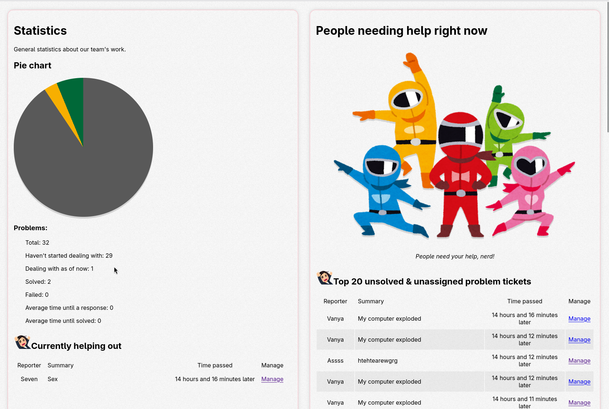

# Praktisk eksamen forberedelse

## Get started

### Prerequisites

- Python 3 installed

### Running

- Linux
    - Run `$ cd src && python3 app.py`
- Windows Desktop
    - Run `> cd src && python app.py`

## FAQ

## What is `vendor/moeserver`?

If I can call it, a "framework" of mine for web app development.

- HTTP protocol handler, powered by IPv4, asyncronous request handling with socket selectors.
- Routing
- Server Side Rendering
- User has byte-level access to the output of the routing without extra complexity
- No external libraries.

It's been used in 3 commertial projects each iterating on its feature set, this project uses version `2.1`.

I deemed it good enough for this exam.

## Legal notice

> Praktisk eksamen forberedelse Copyright (c) 2026 ved Reshetnikov Ivan - alle rettigheter forbeholdt.
